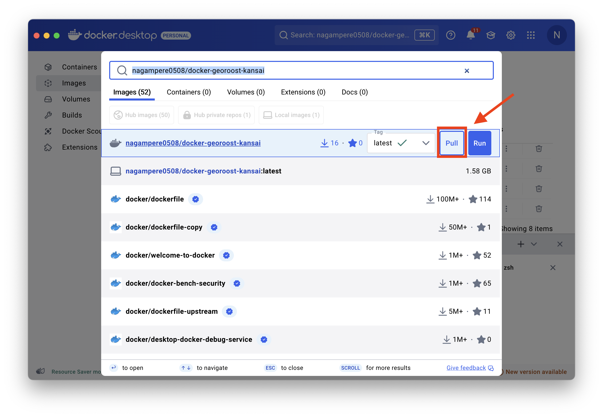
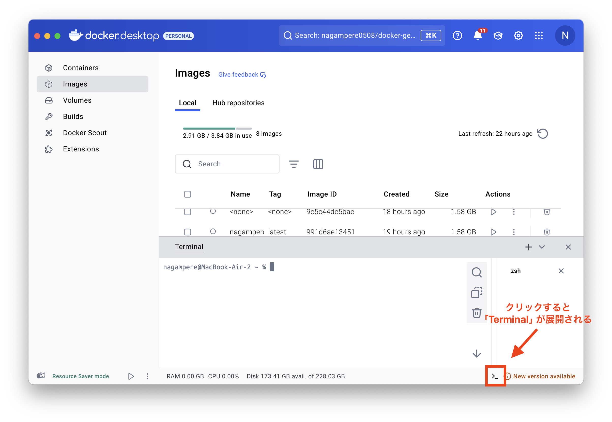
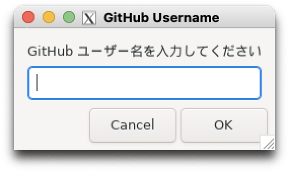
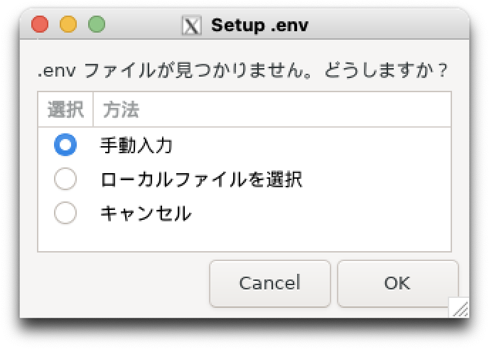
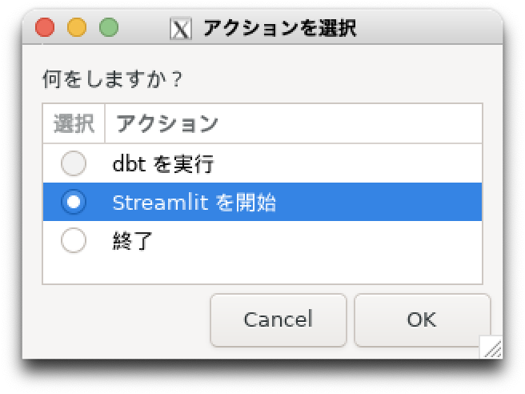

# Welcome to docker-georoost-kansai!

こちらは、[GeoRoost-Kansai](https://github.com/nagampere/georoost-kansai)をDockerを使って起動するためのレポジトリです。GeoRoostはプライベートレポジトリなので、起動するには認証されたGithubアカウントとS3のアクセストークンが必要です。


# Setup

起動するには、以下の3つのステップにしたがってセットアップしてください。

1. [Docker Desktop, XQuartzのインストール](#1-docker-desktop-xquartzのインストール-初期設定)
2. [Dockerイメージのビルド](#2-dockerイメージのビルド)
3. [Dockerコンテナの作成・起動](#3-dockerコンテナの作成・起動)

セットアップ済みの場合

4. [作成したDockerコンテナを再起動](#4-作成したdockerコンテナを再起動)


# 1. Docker Desktop, XQuartzのインストール, 初期設定

## 1.1 インストール

Docker DesktopとXサーバーを、ローカル環境に追加する。

MacOSの場合: [Docker Desktop for Mac](https://www.docker.com/products/docker-desktop/)と[XQuartz](https://www.xquartz.org/)をインストール

Windowsの場合: [Docker Desktop for Win](https://www.docker.com/products/docker-desktop/)と[VcXsrv](VcXsrv Windows X Server)をインストール

## 1.2 Docker Desktopの設定

Setting > Resources > Advancedで、dockerに割り当てるCPU・メモリを設定する。

CPUに4、メモリに8GBを割り当てる。

## 1.3 Xサーバーの設定

### 1.3.1 Macの場合

XQuartzの起動 → XQuartz メニュー → Preferences → Security タブを開いて：

☑️ 「Allow connections from network clients」 をチェック（外部から接続を許可）

その後、XQuartz を再起動

### 1.3.2 Windowsの場合

XLaunchの起動 → Select display settings(既定の設定) → Select how to start clients(既定の設定) → Extra settings

☑️　「Disable access control」 をチェックする（外部から接続を許可）

# 2. Dockerイメージのビルド

## docker cloudからビルドする場合(推奨)

docker desktopを起動後、上部のSearchで「nagampere0508/docker-georoost-kansai」と検索し「Pull」をクリック



# 3. Dockerコンテナの作成・起動

XQuartzもしくはXLaunchは起動した状態にしておく。

## 3.1 ターミナルからコマンドで起動

docker desktopの下部にある「>_」をクリックしてターミナルを展開し、下記のコマンドを入力する。実行情報やエラーはターミナル内で出力される。

※ 「docker: Error response from daemon: Conflict. The container name "/georoost-kansai" is already in use by container "〜〜"」と表示されてエラーになる場合は、左の「Containers」から「georoost-kansai」名義のコンテナを削除する。

### 3.1.1 Macの場合
```bash
xhost + 127.0.0.1
```

```bash
docker run --name georoost-kansai -p 8501:8501 -e DISPLAY=host.docker.internal:0 nagampere0508/docker-georoost-kansai
```

### 3.1.2 Windowsの場合

アクセス制御を無効化されているので、「xhost + 127.0.0.1」は不要。

```bash
docker run --name georoost-kansai -p 8501:8501 -e DISPLAY=host.docker.internal:0 nagampere0508/docker-georoost-kansai
```



## 3.2 Githubアカウントの認証

GUIの指示にしたがって、「Github ユーザー名」、「Github アクセストークン」を入力し、リポジトリのクローンと依存関係のインストールを行う。以降、「OK」をクリックしないと先に進まない。

依存関係のインストールには3分程度かかり、終了したらGUIが再び開く。



※ 「control + v」でペーストできないときは、右クリックから実行できる。

※ 左のタブからContainersを開き、立ち上がったコンテナをクリックしてログを確認すると分かりやすい。

## 3.3 .envファイルの設定

「手動入力」を選択し、「AWS-ACCESS-KEY-ID」、「AWS-SECRET-ACCESS-KEY」、「AWS-DEFAULT-REGION」を入力する。



## 3.4 dbtの実行

「dbtを実行」>「編集せずに実行」を選択。

dbtの実行完了には3分程度かかり、終了したらGUIが再び開く。

##  3.5 streamlitの設定

「Streamlitを開始」を選択し、OKを押して、http://localhost:8501/ をブラウザで開く。



# 4. 作成したDockerコンテナを再起動

1. docker desktopとXサーバーの起動
2. docker desktopのターミナルから、以下のコマンドを実行

Macの場合
```bash
xhost + 127.0.0.1
```

```bash
docker start -ai georoost-kansai
```

Windowsの場合
```bash
docker start -ai georoost-kansai
```

